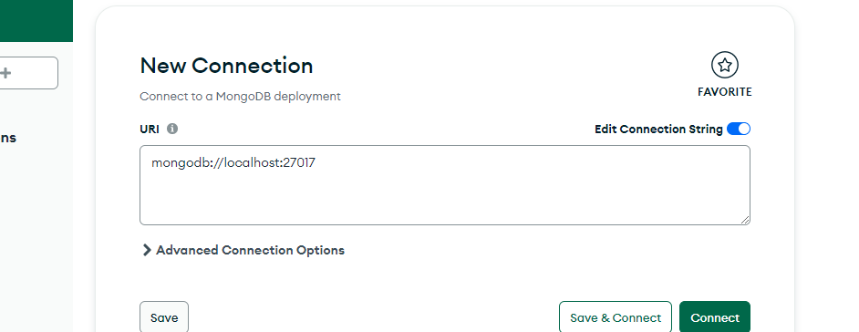

# download mongodb database
https://www.mongodb.com/try/download/community-kubernetes-operator

# after install mongo db open  mongodb application and connect

# copy connection url and paste in app.py this area
"app.config["MONGO_URI"] = "{YOUR CONNECTION URL}}/fitnessapp""

# create new database in mongodb as "fitnessapp"
# create new table in  "fitnessapp" mongodb as "users"

# open projecr folder using vs code
# open terminal in vs code
# create virtual environment  using following commnad
python -m venv myenv
# activate virtual environment 
myenv/Scripts/activate

# install dependencies
pip install -r requirements.txt

# run application
flask --app app.py --debug run
